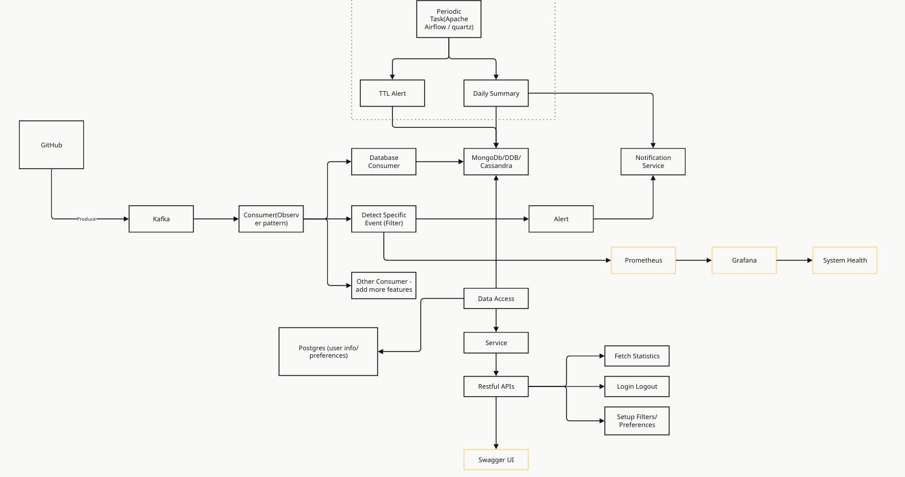

# Define the problem
event-driven app is common in backend development. Among event sources we can either collect real-world data using arduino or use public event API like twitter event api and github webhook. I choose github webhook because it is convenient to get and it can leads to more interesting processing than twitter data. however the downside is it is difficult to acces to large public github repo. Therefore it would be difficult to expose to real-word data and experience heacy concurrent workload. 
# Define the functions that app should have
* daily event capturing : extract features - tags - categborize 
* statisc analysis 
* track issues/pull requests long for open and not merged - notification
* 对于'issues'/'pull request'相关event可以去extract labels. 对于标有high-priotity的可以做成一个daily notification。然后还可以去统计频率比较高的Labels。
* 对于Issues的话可以设置一个TTL, 超过一段时间没close的可以generate alerts 
* 对于'pull request' ，每open一个request可以生成一个notification发送给相关stakeholder
# tech stack
springboot + kafka(for event streaming)
# functions to implement
* daily event capturing : extract features - tags - categborize 
* statisc analysis 
* track issues/pull requests long for open and not merged - notification
1. 对于'issues'/'pull request'相关event可以去extract labels. 对于标有high-priotity的可以做成一个daily notification。然后还可以去统计频率比较高的Labels。
2. 对于Issues的话可以设置一个TTL, 超过一段时间没close的可以generate alerts 
3. 对于'pull request' ，每open一个request可以生成一个notification发送给相关stakeholder

# Architecture

  

# Steps
1. open a github repo
2. setup local dev environment
3. design Resultful APIs
4. design database schema (relational database)
5. setup kafka(local + cloud), setup conumer 
6. implement database consumer
7. implement mongodb database connector
8. implement event filters (user can setup new filters dynamically)
9. implement APIs (fetching stats, setup filters) (event-filter-service) 
10. authentication (login logout) (user service)
11. setup swagger UI
12. setup prometheus

# Implementation 
**Understand github webhook event**
- read official docs
- use ngrok to expose local app to the public internet 
- set up webhook on my personal experimental repo 

**Receive github webhook payload**
- broader concept: spring mvc
- write the controller 
- check json structure of the payload 

**set up kafka**
- Docker
- kafka configs 
- test: in docker using shell commands to verify kafka is able to run, and write/read events. 

**determine the architecture of springboot application**
- service: business logic
- controller: handle http request
- entity: data model
- config: configuration of the application

**implement kafka in springboot**
- write producer
- based on steps: should have two consumers. Place two different consumers into different consumer groups so that the consuming the same topic(i set a single topic for this app containing all incoming events) is independent. 

**Set up Mongodb and define data schema**
- Issue event data format 
- Deserialization of json payload(more implementation detail like use jackson lib)

**Implement use authentication**
- understand logic of register and login
- read docs of jwt and java jwt library
- design pattern: builder pattern for jwt object
- configure and implement spring security(i ignore this part in review because of too many codes. it includes write jwt service, add jwt filter in security chain)

**Implement Filters set by users**
- this part depend on the previous one because it needs securitycontext(another spring concept i need to be aware of)
- data model: hashset 
- controller and service 
- this is where i implement mongodb bulk write(mongotemplate) to reduce roundtrip time of writing to the database. 

**Configure SWAGGER UI**
- UI endpoint address 
- spring configuration and dependency
- test authentication

**Use AWS SQS**
- Motivation: decouple event procesing and even notifications. for example if event processing is crashed notifications can still be sent. 
- read AWS SQS docs, understand different queue type(ordering)
- configure aws authentication 
- implment sqs write and consume. i read (different versions of) aws sqs library carefully, looking for example codes, and implement it. I then test sqs write/read(this part i write independent codes under test/, but it may not be the best and efficient way to test). I solve version confilicts between java aws version and spring cloud aws.  

**Email notification** 
- Use AWS sms
- Perform end-to-end test, checking whehter a single email received
- Register an business email domain and release the sandbox state happen in the cloud deployment stage. 

**Monitoring**
- Prometheus and Grafana 
- 断了（从4月末心态崩溃到7月中下旬） 
- Configure Prometheus
- Configure Grafana
- Visualization
- difficulty: In the first time setting up Grafana, i cannot see database read/write count shown in the diagram. This is related how to increment counter in codes. I shouold have embedded this operation after each database read/write, but not explore using docs/internet information to use other methods like using annotation in repository layer.

**From Monitoring discover the major issue**
- Load Test: write two separate test. user register/login and simulating github event send. i adjust sending rate at different levelts: `[5, 10, 15, 20, 50, 100]`per second. And i enable it to work on concurrency. 
- Problem description: database read/write count extremely slower than event sending rate. they should be the same. 
- Solve the problem: i mistakenly think that it maybe due to database read/write. maybe read too many data per round-trip. but it is wrong. i ask someone for help, he point out that it is resulted from sqs synchronoze operation blocking the whole thread, so i need to change it to async. 
- Learning experience: I fail to think to this level and point: sync/async/block/thread. In the whole logic: use kafka listener annotation hide some details: it let the thread in while(message come). so if sqs sync opetations keep blocking for each single email sent, it reduce the previous operations of read/write on database, which is a signal of slowing the down the entire filter operations. 

**Solve the major problem using sqs async**
- adjustment: use localstack to assemble all tools to local dev
- at the receiver side(event-notification), add concurrency. 
- exponential backoff machenism
- RateLimiter: source is when run the whole project and set the event sending-rate at a specific level, process crashed and report some error messages. based on the error message i am able to know that: `sqs receiver`'s request overwhelmed the system. i rate-limit it to 10 req/sec. Interetstingly sqs sender did not have such issue. The expalanation has not been recorded, so i recorded here: sender only send request when there is an email to be sent, but receive message request kept sent to sqs frequently, which may exhaust the thread pool. 

**Deploy to cloud**
- platform: Heroku 
- tech stack moved to cloud. 
- modify application configs based on the previous part. 
- When deploy to heroku, project is pacakged -> compiled -> run. there are some bugs in this process like those related to static methods, i fix all of these. 
- test: end-to-end test on a single email succeed. 

# Notes 
* 核心问题是断掉节奏，已经没有稳定持续的文档记录。
* The whole project is simplified to: filter a single type of event(issue event), and succesfully send its notification.  
* One thing i done very well is to use LOGGER to log information for debugging. like add message `message sent` after each `sqs.sendMessage()` call.  
* Textbook knowledge like concurrency, thread, async how these apply to practical project analysis. When thinking of the problem in project, i hardly call these concepts to help with the analysis. 
* There are some missing steps to be considered: source codes(includes sqs and jwt authentication part, i may need to understand every bit of the codes i have written), bug i faced(like database collection mapping, the bug i discussed in this doc) and monitoring on cloud. This reminds me of set up docker, set up application on cloud and how to configure these accordingly.  
* Design decisions: why use concurrency on sqs receive side in the application, how it affets performance and create some potential bugs? I need to dive into concurrency scenario and understand java non-blocking I/O and concurrency model.  

